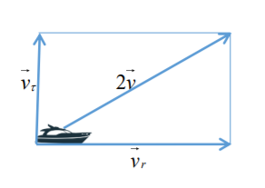
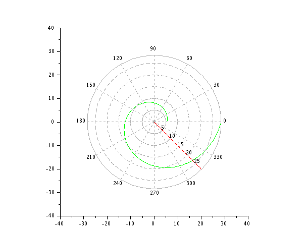
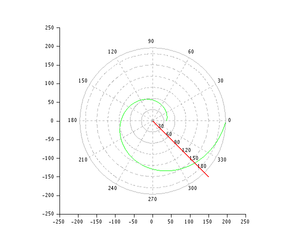

---
# Front matter
lang: ru-RU
title: "Лабораторная работа 2"
subtitle: "Задача о погоне"
author: "Сырцов Александр Юрьевич"

# Formatting
toc-title: "Содержание"
toc: true # Table of contents
toc_depth: 2
lof: true # List of figures
lot: true # List of tables
fontsize: 12pt
linestretch: 1.5
papersize: a4paper
documentclass: scrreprt
polyglossia-lang: russian
polyglossia-otherlangs: english
mainfont: PT Serif
romanfont: PT Serif
sansfont: PT Sans
monofont: PT Mono
mainfontoptions: Ligatures=TeX
romanfontoptions: Ligatures=TeX
sansfontoptions: Ligatures=TeX,Scale=MatchLowercase
monofontoptions: Scale=MatchLowercase
indent: true
pdf-engine: lualatex
header-includes:
  - \linepenalty=10 # the penalty added to the badness of each line within a paragraph (no associated penalty node) Increasing the value makes tex try to have fewer lines in the paragraph.
  - \interlinepenalty=0 # value of the penalty (node) added after each line of a paragraph.
  - \hyphenpenalty=50 # the penalty for line breaking at an automatically inserted hyphen
  - \exhyphenpenalty=50 # the penalty for line breaking at an explicit hyphen
  - \binoppenalty=700 # the penalty for breaking a line at a binary operator
  - \relpenalty=500 # the penalty for breaking a line at a relation
  - \clubpenalty=150 # extra penalty for breaking after first line of a paragraph
  - \widowpenalty=150 # extra penalty for breaking before last line of a paragraph
  - \displaywidowpenalty=50 # extra penalty for breaking before last line before a display math
  - \brokenpenalty=100 # extra penalty for page breaking after a hyphenated line
  - \predisplaypenalty=10000 # penalty for breaking before a display
  - \postdisplaypenalty=0 # penalty for breaking after a display
  - \floatingpenalty = 20000 # penalty for splitting an insertion (can only be split footnote in standard LaTeX)
  - \raggedbottom # or \flushbottom
  - \usepackage{float} # keep figures where there are in the text
  - \floatplacement{figure}{H} # keep figures where there are in the text
---

# Цель работы

Необходимо с помощью системы ОДЕ промоделировать погоню и найти, в какой она закончится успешно, а именно: катер береговой охраны догонет лодку браконьеров.

# Задание

1. Записать уравнение, описывающее движение катера, с начальными
условиями для двух случаев (в зависимости от расположения катера
относительно лодки в начальный момент времени).
2. Построить траекторию движения катера и лодки для двух случаев.
3. Найти точку пересечения траектории катера и лодки 

# Выполнение лабораторной работы

## Контекст

Вариант 42
На море в тумане катер береговой охраны преследует лодку браконьеров.
Через определенный промежуток времени туман рассеивается, и лодка
обнаруживается на расстоянии 16,1 км от катера. Затем лодка снова скрывается в
тумане и уходит прямолинейно в неизвестном направлении. Известно, что скорость
катера в 3,9 раза больше скорости браконьерской лодки.

## Рассуждения

Опираясь на методичку имеем разложение скорости на тангенциальную и радиальную составляющие (рис. -@fig:001).

{ #fig:001 width=70% }

Очевидно, что `2v` на схеме это ни что иное, как скорость катера, которая в 2 раза выше скорости лодки. В нашем случае скорость лодки больше в 3.9 раз, поэтому подставляем это значение. Нам необходима тангенциальная скорость с новым значением параметра, так что, используя теорему пифагора, получаем

$$
  v_{\tau} = 3.76962 v
$$

Также меняем начальные условия для двух случаев

$$
  \begin{cases}
    \theta_0 = 0 \\
    r_0 = 16.1/3
  \end{cases}
$$

$$
  \begin{cases}
    \theta_0 = -\pi \\
    r_0 = 16.1
  \end{cases}
$$

## Процесс выполнения

1. Пишем код

```scilab
//функция, описывающая движение катера береговой охраны
function dr = f(angle, radius)
	dr = radius / 3.76962;
endfunction;

//начальные условия в случае 1
r0 = 16.1 / 3;
tetha0 = 0;
t = 0:1:20;

//начальные условия в случае 2
r0 = 16.1;
tetha0 = -%pi;
t = 0:1:150;

tetha = 0:0.01:2 * %pi;
r = ode(r0, tetha0, tetha, f);

//функция, описывающая движение лодки браконьеров
function xt = f2(time)
	xt = tan(3 * %pi / 4) * time;
endfunction;

polarplot(tetha, r, style = color('green'));
plot2d(t, f2(t), style = color('red'));

```

2. Ищем точку пересечения.

В первом случае катер нагоняет лодку довольно быстро - точка пересечения будет примерно в окрестности 23км от начала координат, угол тот же, что в коде (рис. -@fig:002).

$$
  \begin{cases}
    \theta_{intersect} = 3\pi/4 \\
    r_{intersect} \approx 23
  \end{cases}
$$

{ #fig:002 width=70% }

Во втором случае погоня продлиться дольше засчёт большей дистанции (рис. -@fig:003).

$$
  \begin{cases}
    \theta_{intersect} = 3\pi/4 \\
    r_{intersect} \approx 167
  \end{cases}
$$

{ #fig:003 width=70% }

# Выводы

Я познакомился с простейшим моделированием на основе ОДЕ, решив задачу о погоне на языке Scilab.

В ходе работы удалось вывести и решить уравнение

$$
	\frac{\mathrm d r}{\mathrm d \theta}=\frac{r}{\sqrt{n^2-1}}
$$