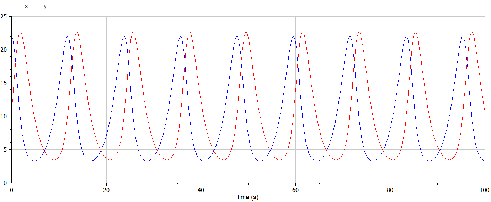
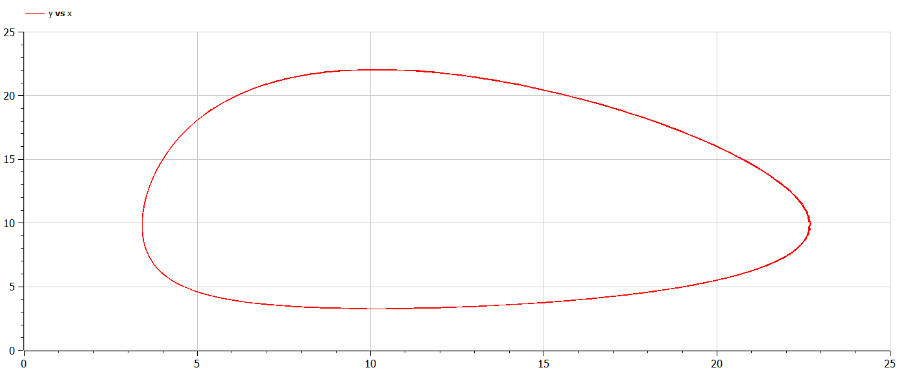
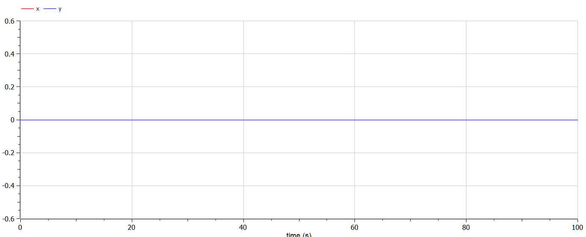
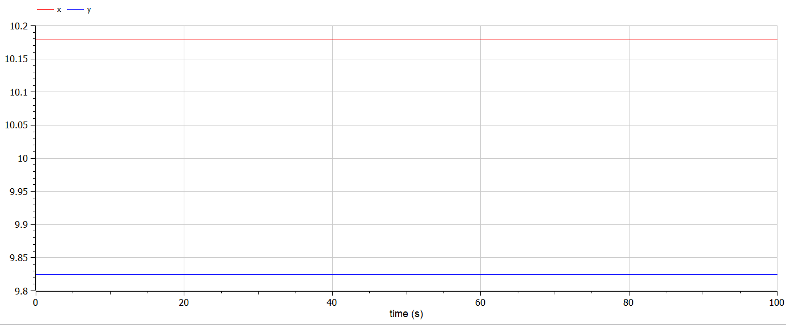

---
# Front matter
lang: ru-RU
title: "Лабораторная работа 5"
subtitle: "Модель двух популяций"
author: "Сырцов Александр Юрьевич"

# Formatting
toc-title: "Содержание"
toc: true # Table of contents
toc_depth: 2
lof: true # List of figures
lot: true # List of tables
fontsize: 12pt
linestretch: 1.5
papersize: a4paper
documentclass: scrreprt
polyglossia-lang: russian
polyglossia-otherlangs: english
mainfont: PT Serif
romanfont: PT Serif
sansfont: PT Sans
monofont: PT Mono
mainfontoptions: Ligatures=TeX
romanfontoptions: Ligatures=TeX
sansfontoptions: Ligatures=TeX,Scale=MatchLowercase
monofontoptions: Scale=MatchLowercase
indent: true
pdf-engine: lualatex
header-includes:
  - \linepenalty=10 # the penalty added to the badness of each line within a paragraph (no associated penalty node) Increasing the value makes tex try to have fewer lines in the paragraph.
  - \interlinepenalty=0 # value of the penalty (node) added after each line of a paragraph.
  - \hyphenpenalty=50 # the penalty for line breaking at an automatically inserted hyphen
  - \exhyphenpenalty=50 # the penalty for line breaking at an explicit hyphen
  - \binoppenalty=700 # the penalty for breaking a line at a binary operator
  - \relpenalty=500 # the penalty for breaking a line at a relation
  - \clubpenalty=150 # extra penalty for breaking after first line of a paragraph
  - \widowpenalty=150 # extra penalty for breaking before last line of a paragraph
  - \displaywidowpenalty=50 # extra penalty for breaking before last line before a display math
  - \brokenpenalty=100 # extra penalty for page breaking after a hyphenated line
  - \predisplaypenalty=10000 # penalty for breaking before a display
  - \postdisplaypenalty=0 # penalty for breaking after a display
  - \floatingpenalty = 20000 # penalty for splitting an insertion (can only be split footnote in standard LaTeX)
  - \raggedbottom # or \flushbottom
  - \usepackage{float} # keep figures where there are in the text
  - \floatplacement{figure}{H} # keep figures where there are in the text
---

# Цель работы

Изучить модель популяций хищников и добычи.

# Задание

Построить график зависимости численности хищников от численности жертв,
а также графики изменения численности хищников и численности жертв при
задданных начальных условиях. Найти стационарные состояния.

# Выполнение лабораторной работы

## Контекст

Пусть у нас есть две популяции: хищники `x` и добыча `y`. Изменения обоих популяций будет выражаться в производных

$$ \dot{x} , \dot{y} $$

В первую очередь скажем, что хищники умерают естественным путём c частотой `a`

$$ \dot{x} = -ax $$

Чем больше умирает хищников, тем больше добыча может размножаться

$$ \dot{y} = by $$

Из этих двух уравнениий следует не самый приятный исход в виде скорого вымирания хищников и бесконечного размножения хищников, поэтому усложняем систему и вводим фактор, увеличивающий популяцию хищников. Пусть рост популяции хищников зависит от пропитания, поэтому, чем больше хищники успешно охотятся на добычу, тем больше растёт популяция хищников

$$ \dot{x} = -ax + cxy $$

Успешая охота равнозначна смерти добычи, поэтому дополняем уравнение для `y`

$$ \dot{y} = by - dxy $$

Получается следующая система, называемая системой уравнений Лотки Вольтерра, которую необходимо решить

$$
  \begin{cases}
    \dot{x} = -ax + cxy \\
    \dot{y} = by - dxy
  \end{cases}
$$

В моём случае в соответствии с вариантом 42

$$
  \begin{cases}
    \dot{x} = -0.56x + 0.057xy \\
    \dot{y} = 0.57y - 0.056xy
  \end{cases}
$$

## Рассуждения

Построить решение не сложно, вопрос в том, как найти стационарные состояния системы. Рассмотрим уравнения не с позиции модели, а с позиции обыкновенных производных, что мы о них знаем? Мы знаем, что у производных есть экстремумы - точки, где 1) не происходит изменения значений и 2) производные равны нулю.

Решим систему уравнений

$$
  \begin{cases}
    -ax + cxy = 0\\
    by - dxy = 0
  \end{cases}
$$

$$
  \begin{cases}
    x(-a + cy) = 0\\
    y(b - dx) = 0
  \end{cases}
$$

Первое решение

$$
  \begin{cases}
    x = 0\\
    y = 0
  \end{cases}
$$

Второе решение

$$
  \begin{cases}
    x = с/d \\
    y = a/b
  \end{cases}
$$

Таким образом получаем две критические точки: (0, 0), (c/d, a/b).

## Процесс выполнения

### Пишем код

Сначала запишем решение уравнения с начальными условиями

$$
  \begin{cases}
    x(0) = 11 \\
    y(0) = 22
  \end{cases}
$$

```modelica

model population
	parameter Real a = 0.56;
	parameter Real b = 0.057;
	parameter Real c = 0.57;
	parameter Real d = 0.056;
	
	Real x(start = 11);
	Real y(start = 22);

equation
	der(x) = -a*x + a*x*y;
	der(y) = c*y - d*x*y;

end population;

```

Полученное графическое решение в виде фазовой схемы (рис. -@fig:001) и обычного графика (рис. -@fig:002).

{ #fig:001 width=70% }

{ #fig:002 width=70% }

Теперь строим интегральные кривые с критическими точками, чтобы увидеть поведение стационарной системы.

$$
  \begin{cases}
    x(0) = 0 \\
    y(0) = 0
  \end{cases}
$$

```modelica

model population_steady_state1
	parameter Real a = 0.56;
	parameter Real b = 0.057;
	parameter Real c = 0.57;
	parameter Real d = 0.056;
	
	Real x(start = 0);
	Real y(start = 0);

equation
	der(x) = -a*x + b*x*y;
	der(y) = c*y - d*x*y;

end population_steady_state1;

```

Второе решение (рис. -@fig:003).

{ #fig:003 width=70% }

Последняя система

$$
  \begin{cases}
    x(0) = с/d \\
    y(0) = a/b
  \end{cases}
$$

```modelica

model population_steady_state2
	parameter Real a = 0.56;
	parameter Real b = 0.057;
	parameter Real c = 0.57;
	parameter Real d = 0.056;
	
	Real x(start = с/d);
	Real y(start = a/b);

equation
	der(x) = -a*x + b*x*y;
	der(y) = c*y - d*x*y;

end population_steady_state2;

```

Третье решение (рис. -@fig:003).

{ #fig:004 width=70% }

# Выводы

По результатам моделирования удалось получить решения и проанализировать поведение системы при разных начальных условиях, в том числе в стационарном режиме.

# Источники

https://ocw.mit.edu/courses/mathematics/18-03sc-differential-equations-fall-2011/unit-iv-first-order-systems/linearization-near-critical-points/example-predator-prey-and-volterras-principle/