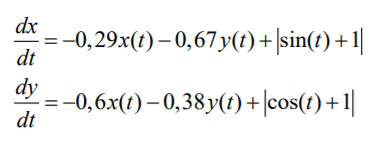
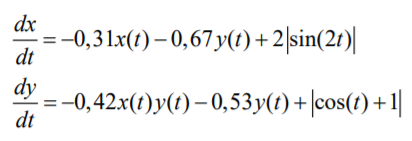
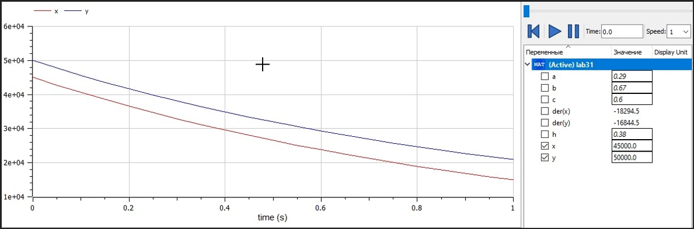
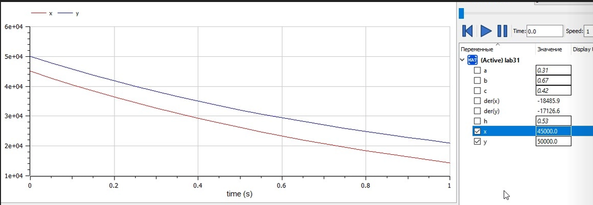

---
# Front matter
lang: ru-RU
title: "Лабораторная работа 3"
subtitle: "Модель сражения"
author: "Сырцов Александр Юрьевич"

# Formatting
toc-title: "Содержание"
toc: true # Table of contents
toc_depth: 2
lof: true # List of figures
lot: true # List of tables
fontsize: 12pt
linestretch: 1.5
papersize: a4paper
documentclass: scrreprt
polyglossia-lang: russian
polyglossia-otherlangs: english
mainfont: PT Serif
romanfont: PT Serif
sansfont: PT Sans
monofont: PT Mono
mainfontoptions: Ligatures=TeX
romanfontoptions: Ligatures=TeX
sansfontoptions: Ligatures=TeX,Scale=MatchLowercase
monofontoptions: Scale=MatchLowercase
indent: true
pdf-engine: lualatex
header-includes:
  - \linepenalty=10 # the penalty added to the badness of each line within a paragraph (no associated penalty node) Increasing the value makes tex try to have fewer lines in the paragraph.
  - \interlinepenalty=0 # value of the penalty (node) added after each line of a paragraph.
  - \hyphenpenalty=50 # the penalty for line breaking at an automatically inserted hyphen
  - \exhyphenpenalty=50 # the penalty for line breaking at an explicit hyphen
  - \binoppenalty=700 # the penalty for breaking a line at a binary operator
  - \relpenalty=500 # the penalty for breaking a line at a relation
  - \clubpenalty=150 # extra penalty for breaking after first line of a paragraph
  - \widowpenalty=150 # extra penalty for breaking before last line of a paragraph
  - \displaywidowpenalty=50 # extra penalty for breaking before last line before a display math
  - \brokenpenalty=100 # extra penalty for page breaking after a hyphenated line
  - \predisplaypenalty=10000 # penalty for breaking before a display
  - \postdisplaypenalty=0 # penalty for breaking after a display
  - \floatingpenalty = 20000 # penalty for splitting an insertion (can only be split footnote in standard LaTeX)
  - \raggedbottom # or \flushbottom
  - \usepackage{float} # keep figures where there are in the text
  - \floatplacement{figure}{H} # keep figures where there are in the text
---

# Цель работы

Научится моделировать простейшую систему, описывающую сражение двух армий.

# Задание

Вариант 42
Построить графики изменения численности войск армии Х и армии У для
следующих случаев:

1. Модель боевых действий между регулярными войсками.
2. Модель ведение боевых действий с участием регулярных войск и
партизанских отрядов.

# Выполнение лабораторной работы

## Контекст

Между страной Х и страной У идет война. Численность состава войск
исчисляется от начала войны, и являются временными функциями x(t) и y(t). В начальный момент времени страна Х имеет армию численностью 45 000 человек, а в распоряжении страны У армия численностью в 50 000 человек. Для упрощения модели считаем, что коэффициенты a, b, c, h постоянны. Также считаем P(t) и Q(t) непрерывные функции

Система ОДЕ описывающая битву между регулярными армиями (рис. -@fig:001).

{ #fig:001 width=70% }

Модель ведения боевых действий с участием партизанских отрядов (рис. -@fig:002).

{ #fig:002 width=70% }

## Процесс выполнения

1. Пишем код

```openmodelica
// первый случай
model lab31
  parameter Real a = 0.29;
  parameter Real b = 0.67;
  parameter Real c = 0.6;
  parameter Real h = 0.38;

  Real x(start=45000);
  Real y(start=50000);

equation
  der(x) = -a*x - b*y + abs(sin(time) + 1);
  der(y) = -c*x - h*y + abs(cos(time) + 1);

end lab31;


// второй случай
model lab32
  parameter Real a = 0.31;
  parameter Real b = 0.67;
  parameter Real c = 0.42;
  parameter Real h = 0.53;

  Real x(start=45000);
  Real y(start=50000);

equation
  der(x) = -a*x - b*y + 2*abs(sin(2*time));
  der(y) = -c*x - h*y + abs(cos(time) + 1);

end lab32;
```

2. Сморим на поведение системы.

В первом и втором случае график ведёт себя схожим образом: стана Y лидирует. Имеет место Квадратичный закон Ланчестера.

{ #fig:003 width=70% }

{ #fig:004 width=70% }

Единственное реальное отличие заключается в том, что второй график более выраженно демонстрирует интересную особенность почти реальных сражение: с течением времени чем больше потери одной стороны, тем меньше потери другой. То есть увеличивается разрыв.

# Выводы

Мне удалось освоить модель Ланчестера на начальном уровне и выявить предполагаемого "победителя".