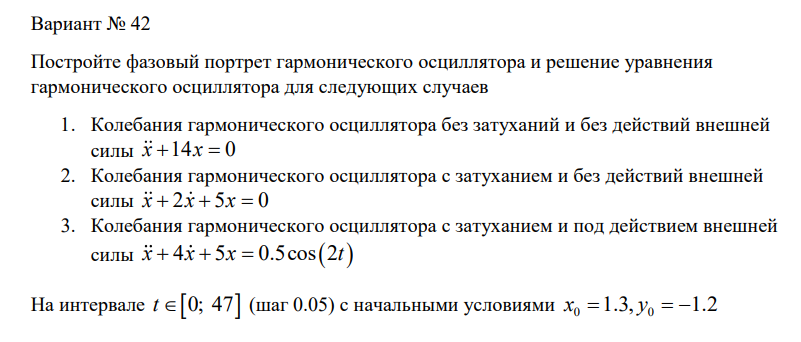
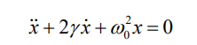
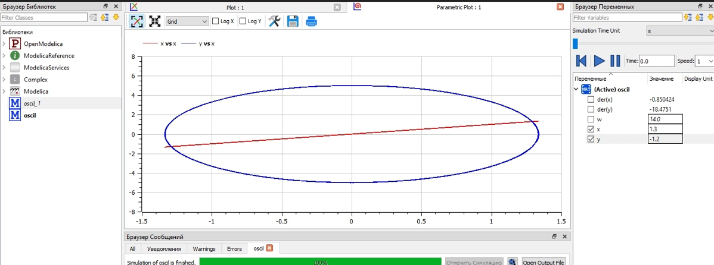
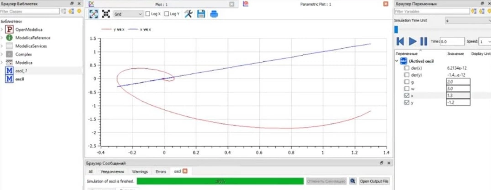
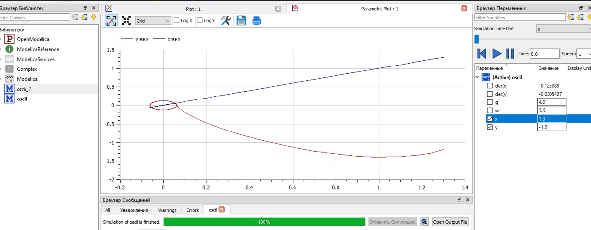

---
# Front matter
lang: ru-RU
title: "Лабораторная работа 4"
subtitle: "Модель гармонических колебаний"
author: "Сырцов Александр Юрьевич"

# Formatting
toc-title: "Содержание"
toc: true # Table of contents
toc_depth: 2
lof: true # List of figures
lot: true # List of tables
fontsize: 12pt
linestretch: 1.5
papersize: a4paper
documentclass: scrreprt
polyglossia-lang: russian
polyglossia-otherlangs: english
mainfont: PT Serif
romanfont: PT Serif
sansfont: PT Sans
monofont: PT Mono
mainfontoptions: Ligatures=TeX
romanfontoptions: Ligatures=TeX
sansfontoptions: Ligatures=TeX,Scale=MatchLowercase
monofontoptions: Scale=MatchLowercase
indent: true
pdf-engine: lualatex
header-includes:
  - \linepenalty=10 # the penalty added to the badness of each line within a paragraph (no associated penalty node) Increasing the value makes tex try to have fewer lines in the paragraph.
  - \interlinepenalty=0 # value of the penalty (node) added after each line of a paragraph.
  - \hyphenpenalty=50 # the penalty for line breaking at an automatically inserted hyphen
  - \exhyphenpenalty=50 # the penalty for line breaking at an explicit hyphen
  - \binoppenalty=700 # the penalty for breaking a line at a binary operator
  - \relpenalty=500 # the penalty for breaking a line at a relation
  - \clubpenalty=150 # extra penalty for breaking after first line of a paragraph
  - \widowpenalty=150 # extra penalty for breaking before last line of a paragraph
  - \displaywidowpenalty=50 # extra penalty for breaking before last line before a display math
  - \brokenpenalty=100 # extra penalty for page breaking after a hyphenated line
  - \predisplaypenalty=10000 # penalty for breaking before a display
  - \postdisplaypenalty=0 # penalty for breaking after a display
  - \floatingpenalty = 20000 # penalty for splitting an insertion (can only be split footnote in standard LaTeX)
  - \raggedbottom # or \flushbottom
  - \usepackage{float} # keep figures where there are in the text
  - \floatplacement{figure}{H} # keep figures where there are in the text
---

# Цель работы

Необходимо научится моделировать гармонические колебания с помощью `oscillating response`.

# Задание

1. Построить решение уравнения гармонического осциллятора без затухания.

2. Записать уравнение свободных колебаний гармонического осциллятора с
затуханием, построить его решение. Построить фазовый портрет гармонических
колебаний с затуханием.

3. Записать уравнение колебаний гармонического осциллятора, если на систему
действует внешняя сила, построить его решение. Построить фазовый портрет
колебаний с действием внешней силы.

# Выполнение лабораторной работы

## Контекст

Постановка задачи (рис. -@fig:001).

{ #fig:001 width=70% }

## Рассуждения

Дано уравнение следующего вида (рис. -@fig:002).

{ #fig:002 width=70% }

Уравнение представляет из себя гомогенное ОДЕ второго порядка при отсуствии воздействия внешних сил и негомогенное при их наличии. Такое уравнение задаёт колебательные движения, то есть повторяющиеся с некоторыми изменениями или статично. Связано такое свойство с общим решением осцилляторов, в котором фигурирует число эйлера в комплексной степени: как известно, любое число в комплексной степени даёт поворот при изменении параметра в степени. Это свойство позваляет, например, записывать триганометрические функции в комплексном виде. Для уравнения выше есть несколько способов решеня, однако мы разделим его на два отдельных уравнения, введя вторую переменную `y`, чтобы было удобно получить численное решение

$$
  \begin{cases}
    \dot{x} = y \\
    \dot{y} = -\omega_0^2x - 2\gamma y
  \end{cases}
$$

Такой способ позволяет не только решить уравнение, но и рассматривать уравнение второго порядка, как два уравнения первого порядка.

Конечно, запись не совсем корректна, так как лучше перенести все слагаемые в одну сторону, но это мелочь, которую исправим позже. Проблемой остаётся случай, когда уравнение негомогенно

$$
  \begin{cases}
    \dot{x}-y=0 \\
    \dot{y}-2\gamma y - \omega_0^2x = g(t)
  \end{cases}
$$

В таком случае можно использовать метод вариации произвольной постоянной. К счастью, `Modelica` не требует специальных модификаций и решает оба варианта автоматически вне зависимости от способа записи.

Важно, что для решения получившейся системы необходимо задать начальные условия для обеих переменных: `x` и `y`.

## Процесс выполнения

### Пишем код

Первое уравнение (рис. -@fig:003).

```modelica

model oscil_1
	parameter Real w = 14;
	Real x(start = 1.3);
	Real y(start = -1.2);
equation
	der(x) = y;
	der(y) = -w*x;
end oscil_1;


```
{ #fig:003 width=70% }

Второе уравнение (рис. -@fig:004).
```modelica

model oscil_2
	parameter Real g = 2;
	parameter Real w = 5;
	Real x(start = 1.3);
	Real y(start = -1.2);
equation
	der(x) = y;
	der(y) = -g*y - w*x;
end oscil_2;

```
{ #fig:004 width=70% }

Третье уравнение (рис. -@fig:005).
```modelica

model oscil_3
	parameter Real g = 4;
	parameter Real w = 5;
	Real x(start = 1.3);
	Real y(start = -1.2);
equation
	der(x) = y;
	der(y) = -g*y - w*x - 0.5*cos(2*time);
end oscil_3;

```
{ #fig:005 width=70% }

# Выводы

Мне удалось получить решение для трёх случаев и научиться моделировать гормонические колебания для разных случаев.