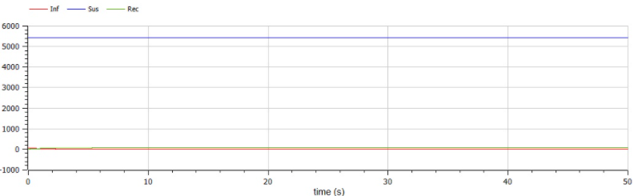
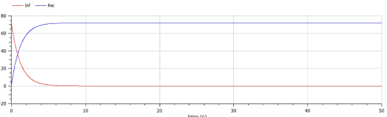
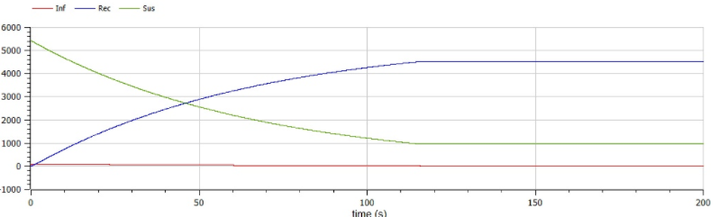
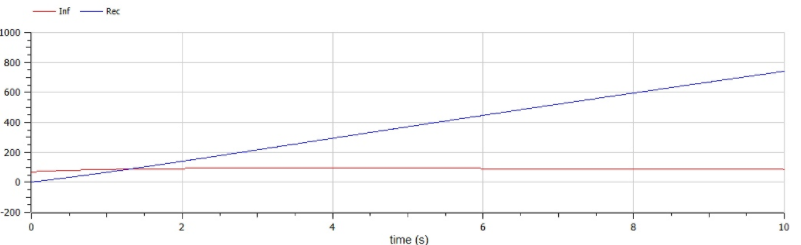

---
# Front matter
lang: ru-RU
title: "Лабораторная работа 6"
subtitle: "Модель эпидемии"
author: "Сырцов Александр Юрьевич"

# Formatting
toc-title: "Содержание"
toc: true # Table of contents
toc_depth: 2
lof: true # List of figures
lot: true # List of tables
fontsize: 12pt
linestretch: 1.5
papersize: a4paper
documentclass: scrreprt
polyglossia-lang: russian
polyglossia-otherlangs: english
mainfont: PT Serif
romanfont: PT Serif
sansfont: PT Sans
monofont: PT Mono
mainfontoptions: Ligatures=TeX
romanfontoptions: Ligatures=TeX
sansfontoptions: Ligatures=TeX,Scale=MatchLowercase
monofontoptions: Scale=MatchLowercase
indent: true
pdf-engine: lualatex
header-includes:
  - \linepenalty=10 # the penalty added to the badness of each line within a paragraph (no associated penalty node) Increasing the value makes tex try to have fewer lines in the paragraph.
  - \interlinepenalty=0 # value of the penalty (node) added after each line of a paragraph.
  - \hyphenpenalty=50 # the penalty for line breaking at an automatically inserted hyphen
  - \exhyphenpenalty=50 # the penalty for line breaking at an explicit hyphen
  - \binoppenalty=700 # the penalty for breaking a line at a binary operator
  - \relpenalty=500 # the penalty for breaking a line at a relation
  - \clubpenalty=150 # extra penalty for breaking after first line of a paragraph
  - \widowpenalty=150 # extra penalty for breaking before last line of a paragraph
  - \displaywidowpenalty=50 # extra penalty for breaking before last line before a display math
  - \brokenpenalty=100 # extra penalty for page breaking after a hyphenated line
  - \predisplaypenalty=10000 # penalty for breaking before a display
  - \postdisplaypenalty=0 # penalty for breaking after a display
  - \floatingpenalty = 20000 # penalty for splitting an insertion (can only be split footnote in standard LaTeX)
  - \raggedbottom # or \flushbottom
  - \usepackage{float} # keep figures where there are in the text
  - \floatplacement{figure}{H} # keep figures where there are in the text
---

# Цель работы

Изучить модель распространения болезни.

# Задание

Построить графики для двух сценариев распространения болезни.

# Выполнение лабораторной работы

## Контекст

Система начинается с того, что у нас есть популяция. Она может расти, а может быть задано константой. Например, константой `N`. Далее рассмотрм эту популяцию с позиции несмертельного заболевания. Она будет поделена на 3 категории: ещё здоровые, но подверженные риску заразиться `S` или `Suspected`, `I` или `Infected` и `R` - `Recovered` - те, кто выздоровел или с самого начала был восприимчив к болезни. Если предположить, что болезнь смертельная, но усложнять модель не стоит, то третья категория совмещает в себе и выздоровевших и погибших - `Removed`.

Зададим поведение модели:
Колличество инфецированных должно расти с некоторой вероятностью исходя из числа здоровых

$$ \frac{dI}{dt} = \alpha S $$

В тоже время количество здоровых лиц падает пропорционально числу новых заболевших

$$ \frac{dS}{dt} = -\alpha S $$

На данном этапе система бы неизбежно пришла к тому, что больные полностью зменят здоровых, поэтому внесём баланс, чтобы показать процесс выздоровления или смерти. Будем оптимистами и будем исходить из выздоровления. Число выздоровевших также будет постоянно расти с некоторой вероятностью, при этом число больных - пропорционально падать

$$ \frac{dI}{dt} = \alpha S - \beta I $$
$$ \frac{dR}{dt} = \alpha I $$

Имеем систему следущего вида

$$
  \begin{cases}
    \frac{dS}{dt} = -\alpha S \\
    \frac{dI}{dt} = \alpha S - \beta I \\
    \frac{dR}{dt} = \beta I
  \end{cases}
$$

При этом мы считаем, что больных нельзя изолировать или можно, но слишком мало. Если же с самого начала учесть сценарий, где с самого начала можно изолировать всех больных или больше, то система будет иметь следующий вид

$$
  \begin{cases}
    \frac{dS}{dt} = 0 \\
    \frac{dI}{dt} = - \beta I \\
    \frac{dR}{dt} = \beta I
  \end{cases}
$$

## Рассуждения

В варианте указаны не все данные, поэтому исходим из следующего: пусть рассматриваемая болезнь - коконавирус, и происходит она в обществе, где удалось обеспечить всех масками и все их носят, тогда уровень заражения 

$$ \alpha = 15\% = 0.015 $$

Но уровень медицины будет низким, поэтому смертность достигает 18%, то есть шанс выздороветь равен 82%

$$ \beta = 0.82 $$

Число тех, кого можно изолировать будет задано по логике того, насколько люди готовы не выходить на работу. Предположим, что при негативном сценарии всего 18 человек можно изолировать, а при положительном 1000.

Исходя из варианта 42 система при негативном сценарии имеет вид

$$
  \begin{cases}
    \frac{dS}{dt} = -0.015 S \\
    \frac{dI}{dt} = 0.015 S - 0.82 I \\
    \frac{dR}{dt} = 0.82 I
  \end{cases}

  \ при \

  \begin{cases}
    S(0) = 5\ 500 - I - R \\
    I(0) = 70 \\
    R(0) = 2 \\
    I^* = 18
  \end{cases}
$$

А позитивный

$$
  \begin{cases}
    \frac{dS}{dt} = 0 \\
    \frac{dI}{dt} = - 0.82 I \\
    \frac{dR}{dt} = 0.82 I
  \end{cases}

  \ при \

  \begin{cases}
    S(0) = 5\ 500 - I - R \\
    I(0) = 70 \\
    R(0) = 2 \\
    I^* = 1000
  \end{cases}
$$

## Процесс выполнения

### Пишем код

Позитивный сценарий

```modelica

model SIR1
  parameter Real spread = 0.015;
  parameter Real recovery = 0.82;

  parameter Real POPULATION = 5500;
  parameter Real ISOLATABLE = 1000;

  Real Sus( start = POPULATION - 70 - 2 );
  Real Inf( start = 70 );
  Real Rec( start = 2 );

equation
  if ISOLATABLE < Inf then
    der( Sus ) = -spread * Sus;
    der( Inf ) = spread * Sus - recovery * Inf;
  else
    der( Sus ) = 0;
    der( Inf ) = -recovery * Inf;
  end if;

der( Rec ) = recovery * Inf;

end SIR1;


```

Графики решения системы в полном виде (рис. -@fig:001) и в соотношении больных к выздоровевшим (рис. -@fig:002).

{ #fig:001 width=70% }
{ #fig:002 width=70% }

Из графиков видно, что изоляция и соблюдение всех мер несмотря на высокую смертность приводят к полному выздоровлению популяции.

Негативный случай

```modelica

model SIR2
  parameter Real spread = 0.015;
  parameter Real recovery = 0.82;

  parameter Real POPULATION = 5500;
  parameter Real ISOLATABLE = 18;

  Real Sus( start = POPULATION - 70 - 2 );
  Real Inf( start = 70 );
  Real Rec( start = 2 );

equation
  if ISOLATABLE < Inf then
    der( Sus ) = -spread * Sus;
    der( Inf ) = spread * Sus - recovery * Inf;
  else
    der( Sus ) = 0;
    der( Inf ) = -recovery * Inf;
  end if;

  der( Rec ) = recovery * Inf;

end SIR2;

```

По аналогии с первым случаем два графика: полный (рис. -@fig:003) и в соотношении больных к выздоровевшим (рис. -@fig:004)

{ #fig:003 width=70% }
{ #fig:004 width=70% }

Несмотря на негативный сценарий модель всё ещё демонстрирует отличные показатели в виде минимального роста числа заболевших, который можно разглядеть с трудом.

# Выводы

1. Я успешно освоил простейшую модель эпидемии, выполнив поставленные задачи.
2. Из обеих моделей можно сделать очевидный вывод, болезнь можно легко одолеть, если вовремя начать предохраняться.

# Источники

Методический материал "Лабораторная работа №5", Д.С. Кулябов.