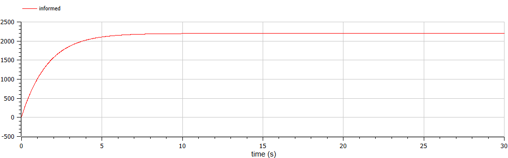
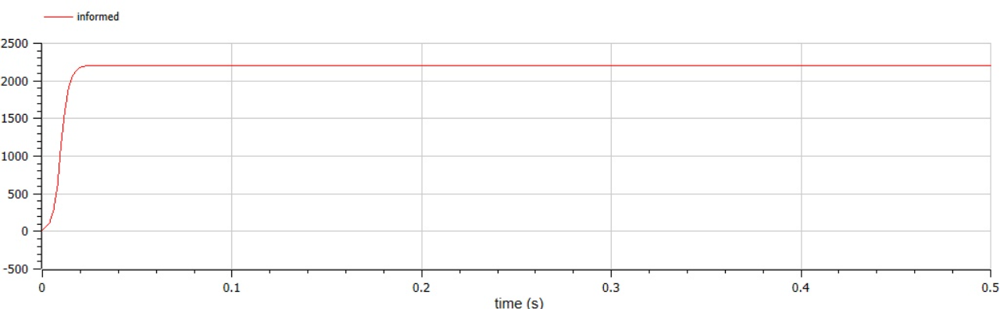
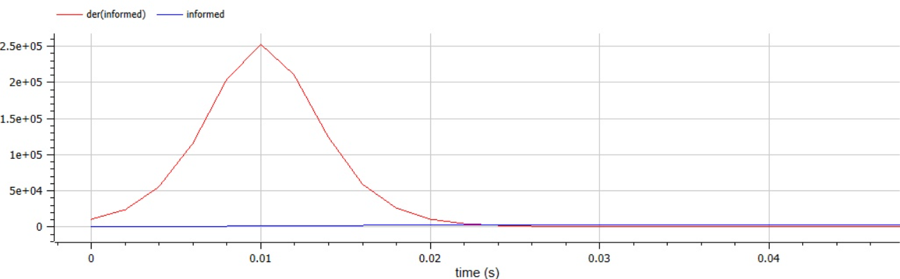
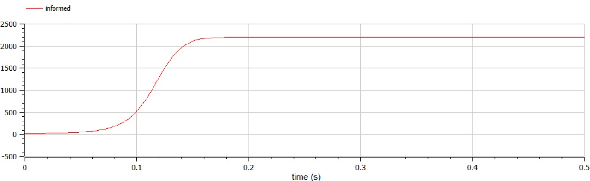

---
# Front matter
lang: ru-RU
title: "Лабораторная работа 7"
subtitle: "Модель рекламы"
author: "Сырцов Александр Юрьевич"

# Formatting
toc-title: "Содержание"
toc: true # Table of contents
toc_depth: 2
lof: true # List of figures
lot: true # List of tables
fontsize: 12pt
linestretch: 1.5
papersize: a4paper
documentclass: scrreprt
polyglossia-lang: russian
polyglossia-otherlangs: english
mainfont: PT Serif
romanfont: PT Serif
sansfont: PT Sans
monofont: PT Mono
mainfontoptions: Ligatures=TeX
romanfontoptions: Ligatures=TeX
sansfontoptions: Ligatures=TeX,Scale=MatchLowercase
monofontoptions: Scale=MatchLowercase
indent: true
pdf-engine: lualatex
header-includes:
  - \linepenalty=10 # the penalty added to the badness of each line within a paragraph (no associated penalty node) Increasing the value makes tex try to have fewer lines in the paragraph.
  - \interlinepenalty=0 # value of the penalty (node) added after each line of a paragraph.
  - \hyphenpenalty=50 # the penalty for line breaking at an automatically inserted hyphen
  - \exhyphenpenalty=50 # the penalty for line breaking at an explicit hyphen
  - \binoppenalty=700 # the penalty for breaking a line at a binary operator
  - \relpenalty=500 # the penalty for breaking a line at a relation
  - \clubpenalty=150 # extra penalty for breaking after first line of a paragraph
  - \widowpenalty=150 # extra penalty for breaking before last line of a paragraph
  - \displaywidowpenalty=50 # extra penalty for breaking before last line before a display math
  - \brokenpenalty=100 # extra penalty for page breaking after a hyphenated line
  - \predisplaypenalty=10000 # penalty for breaking before a display
  - \postdisplaypenalty=0 # penalty for breaking after a display
  - \floatingpenalty = 20000 # penalty for splitting an insertion (can only be split footnote in standard LaTeX)
  - \raggedbottom # or \flushbottom
  - \usepackage{float} # keep figures where there are in the text
  - \floatplacement{figure}{H} # keep figures where there are in the text
---

# Цель работы

Изучить модель распространения болезни.

# Задание

- Построить графики для трёх вариантов
- Для случая 2 найти, момент времени, когда реклама распространяется быстрее всего

# Выполнение лабораторной работы

## Контекст

Пускай у нас есть популяция `n`, которая увеличивается экспоненциально. Рост будет положителен и выражен константой `r`

$$ \frac{dn}{dt} = rn $$

В таком случае мы получим бесконечно увеличивающуюся популяцию. Усложним систему и представим, что она ограничена некоторыми ресурсами, например числом домов для каждого человека, это число будет `N`. из-за постоянного роста `n` постоянно сокращается число свободных домов

$$ \frac{dn}{dt} = r(N-n) $$

Такая система называется моделью роста популяции Мальтуса и описывает рост популяции до момента, когда необходимые ресурсы заканчиваются.

Теперь рассмотрим нашу задачу: нам необходимо описать процесс распространения рекламы некоторого товара. Формула выше остаётся прежней, мы только меняем переменные и исходим из других терминов. Теперь мы считаем, что `N` - максимальное число потенциальных клиентов, а `n` - число проинформированных клиентов.

$$ \frac{dn}{dt} = \alpha_1 (N - n(t)) \ (1)$$

Как известно, реклама работает не только напрямую, но и косвенно, благодаря обсуждению среди обычных людей, так что введём увеличение числа проинформированных через частоту обсуждения проинформированных ранее людей среди потенциальных клиентов

$$ \frac{dn}{dt} =  \alpha_2 n(t)(N - n(t)) \ (2) $$

Если убрать из выражения `n` после альфы, то мы получим неестественное обсуждение продукта среди людей, которые ещё не знают о продукте.

Очевидно, что выражения 1 и 2 задают одно значение, поэтому мы складываем два выражения

$$ \frac{dn}{dt} = (\alpha_1 + \alpha_2 n(t))(N - n(t)) $$

Таким образом получаем выражение, которое и будем решать

## Рассуждения

В соответствии с вариантом 42 мне даны 3 выражения с начальным условием

$$ \frac{dn}{dt} = (0.605 + 0.000017 n(t))(2200 - n(t)) $$
$$ \frac{dn}{dt} = (0.000065 + 0.209 n(t))(2200 - n(t)) $$
$$ \frac{dn}{dt} = (0.51sin(t) - 0.31n(t)t)(2200 - n(t)) $$

$$ n(0) = 21 $$

Нас же интересует не само решение (оно в разделе далее), а поиск момента наибольшей скорости распространения информации в случае второго выражения. В дальнейшем я найду его графически, но стоит сказать и про аналитическое решение.

Как известно из курса физики

$$ \frac{ds}{dt} = v $$

Значит наше исходное уравнение - уравнение скорости распространения рекламы. Поэтому

$$ \underset{n}{argmax}(0.000065 + 0.209 n(t))(2200 - n(t)) -\text{значение} \ n \ \text{при котором наблюдается наибольший рост} $$

Получим n = 91959987/83600

Найдя решение уравнения
$$
  \begin{cases}
    \frac{dn}{dt} = (0.000065 + 0.209 n(t))(2200 - n(t)) \\
    n(0)= 21
  \end{cases}
$$

Подставим найденное `n` и таким образом мы найдём `t`.

## Процесс выполнения

### Пишем код

Первый случай

```modelica

model Malthusian_clients_growth
  parameter Real potentialClients = 2200;
  parameter Real intense_adv = 0.605;
  parameter Real intense_talks = 0.000017;
  Real informed(start = 21);

  equation
    der(informed) = (intense_adv + intense_talks * informed)*(potentialClients - informed);

end Malthusian_clients_growth; 

```

Графическое решение (рис. -@fig:001).

{ #fig:001 width=70% }

второй случай

```modelica

model Malthusian_clients_growth1
  parameter Real potentialClients = 2200;
  parameter Real intense_adv = 0.000065;
  parameter Real intense_talks = 0.209;
  Real informed(start = 21);

  equation
    der(informed) = (intense_adv + intense_talks * informed)*(potentialClients - informed);

end Malthusian_clients_growth1;

```

Графическое решение (рис. -@fig:002).

{ #fig:002 width=70% }

Найдём значение `t`, когда наше `n` максимально (рис. -@fig:003).

{ #fig:003 width=70% }

Из графика `der(informed)` видно, что наибольшая скорость наблюдается в момент времени

$$ t = 0.01 $$

второй случай

```modelica

model Malthusian_clients_growth2
  parameter Real potentialClients = 2200;
  parameter Real intense_adv = 0.51;
  parameter Real intense_talks = 0.31;
  Real informed(start = 21);

  equation
    der(informed) = (intense_adv * sin(time) + intense_talks * time * informed)*(potentialClients - informed);

end Malthusian_clients_growth2;

```
(рис. -@fig:004)
{ #fig:004 width=70% }

# Выводы

1. Я успешно освоил простейшую модель распространения рекламы, выполнив поставленные задачи.
2. Найти значения параметров при максимумах функции можно найти двумя способами.

# Источники

Методический материал "Лабораторная работа №6", Д.С. Кулябов.